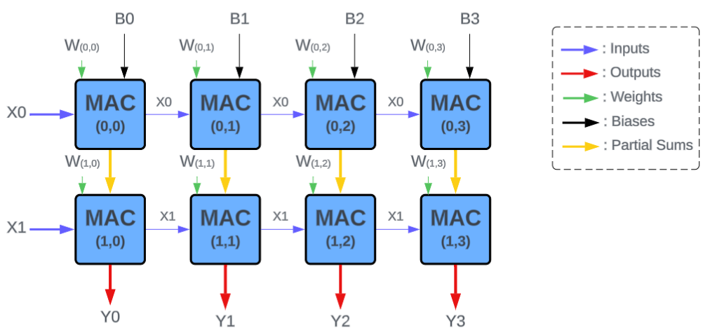
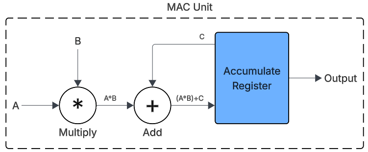

# Systolic-Array Project
## Aims
This is a short project to build on my existing RTL development and verification skills. The aim is to make a parameterisable systolic array with a hierarchal design. In the future, I would also like to put the RTL onto an FPGA and write a program on my computer that allows me to send matrices to the FPGA for it to compute and then return the value.

## Introduction

Systolic arrays are frequently found in hardware accelerators for neural networks. They allow for acceleration of matrix operations such as multiplication or convolution which is essentially what neural networks are - a lot of matrix operations between the inputs, the weights and the biases. The core component of a systolic array is the Multiply ACcumulate (MAC) Unit. Each MAC unit in the array computes a partial result and hands it to the next unit in the grid resulting in a wave of data that cascades through the grid. 

The MAC Unit is made up of a multiplier, an adder and a register to store the accumulated value. The MAC has 5 inputs: X, W, B, clk and n_rst. X and W are inputs to the multiplier, B is the partial sum computed by previous MAC units (or the bias values for the top row of MACs), clk and n_rst are for the clock signal and an active low reset.

## Hardware Specifications/Features
1. Fully Parameterisable Design:
   All modules in the design are parameterisable. The MAC module allows for size of inputs (n) and size of accumulation register (m) to be specified to prevent overflowing after consecutive Multiply and
   Accumulate operations
2. Synchronous Active-Low Reset:
   A synchronous active-low reset allows for noise immunity. The reset signal also allows for a binary value from the C input of the MAC to be loaded into the accumulate register which is how the systolic array
   is able to add biases.

## Verification Strategy:
The verification strategy involved creating self checking test benches for each module. All verification was done using ModelSim. The first phase of the test bench checks for corner cases (for example, testing the maximum limits to ensure adder and multipliers can handle such inputs correctly). The second phase of the test bench performs constrained random testing by using $urandom to generate 100s of random vectors to ensure the answers remain consistent.
A multi tiered nested test bench was created to test the MAC Unit. The unit is made to perform M calculations consecutively before resetting and performing another set of M calculations. This test is repeated N times and the accumulated result is verified throughout the test. This test was to simulate what the unit would be doing if it were performing actual matrix operations.

## Future Expansion:
I plan to create a GUI based app on python that allows the user to input matrices and a desired operation on the matrices and send it via UART to an FPGA running the systolic array. The FPGA then computes the result of the operation and sends it back to the user's computer where the GUI updates with the calculated result.

