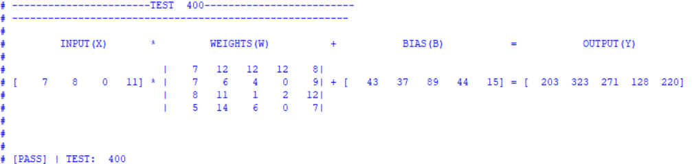

# Systolic-Array Project
## Aims
This is a short project to build on my existing RTL development and verification skills. The aim is to make a parameterisable systolic array with a hierarchal design. I will use the designs from this project in future projects

## Introduction

Systolic arrays are frequently found in hardware accelerators for neural networks. They allow for acceleration of matrix operations such as multiplication or convolution which is essentially what neural networks are - a lot of matrix operations between the inputs, the weights and the biases. The core component of a systolic array is the Multiply ACcumulate (MAC) Unit. Each MAC unit in the array computes a partial result and hands it to the next unit in the grid resulting in a wave of data that cascades through the grid.

One thing to note is that the input Matrix is transposed before being entered into the systolic array. Standard matrix multiplication would require the input to be a row vector for the output to also be a row vector but the horizontal row vector is mapped to a vertical column vector in the diagram of the systolic array. This spatial transposition allows the utilisation of all rows in the grid and so maximises parallelism.

The MAC Unit is made up of a multiplier, an adder and a register to store the accumulated value. The MAC has 5 inputs: X, W, B, clk and n_rst. X and W are inputs to the multiplier, B is the partial sum computed by previous MAC units (or the bias values for the top row of MACs), clk and n_rst are for the clock signal and an active low reset.

## Hardware Specifications/Features
1. Fully Parameterisable Design:
   All modules in the design are parameterisable. The Systolic Array module allows for full control over the input bit size, the size of the grid of MACs and output bit sizes.
2. Synchronous Active-Low Reset:
   A synchronous active-low reset allows for noise immunity.

## Verification Strategy:
A self checking testbench was created for each module. This allowed for easy verification without having to analyse waveforms. For the final systolic array, the test bench computes the operation itself first and then compares it with the result the systolic array mnodule got. A seperate helper function was added that prints the matrix out in proper form to allow for quick paper verification to make sure the test bench was actually computing the values correctly. Below, you can see a snippet of the test bench output.

## Future Expansion:
The Main aim of this project has been completed. I will be using these modules in future projects where I build upon this by adding control units and memory buffers to be able to load in weights and biases.

